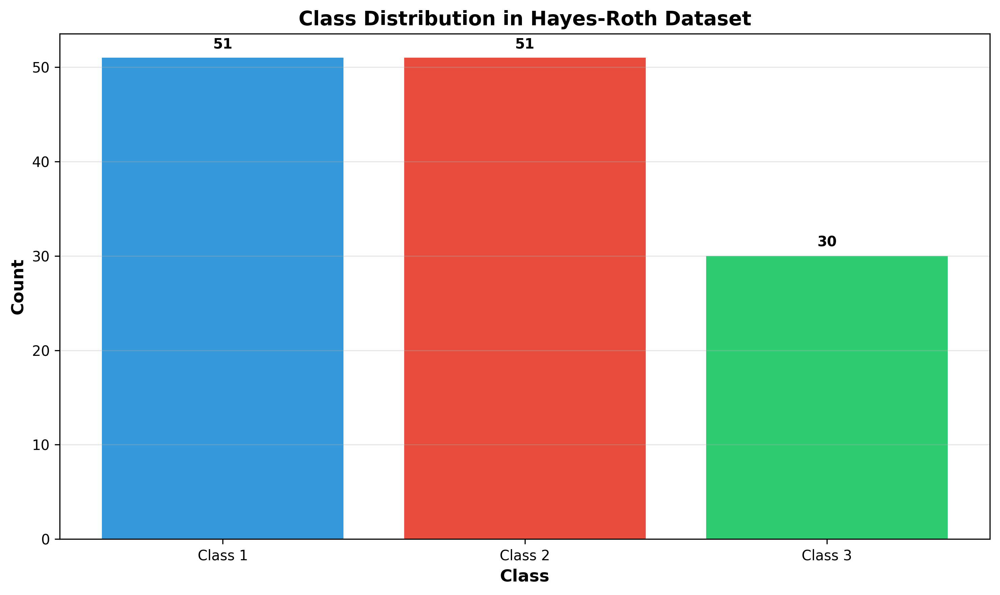
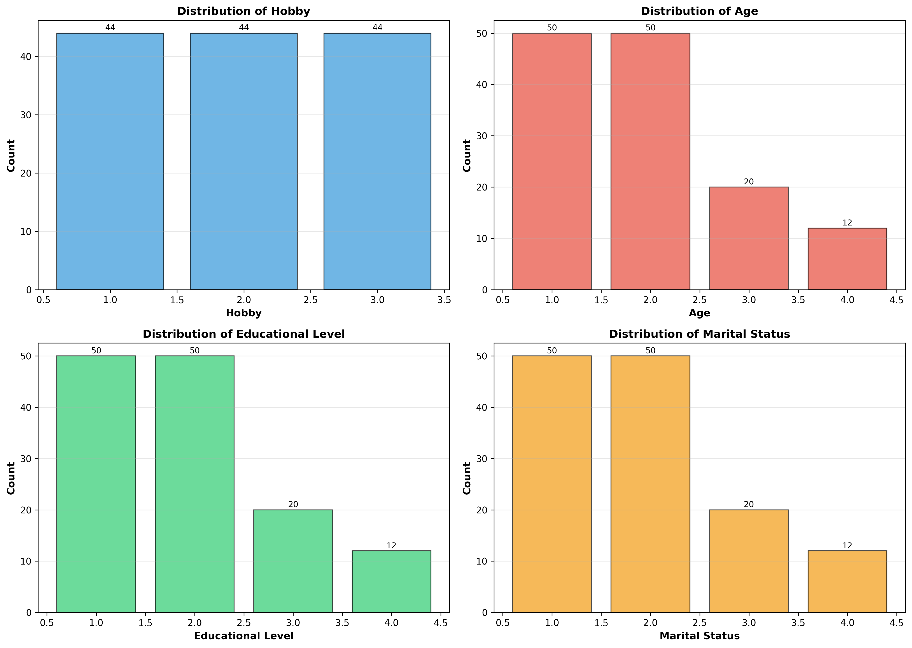
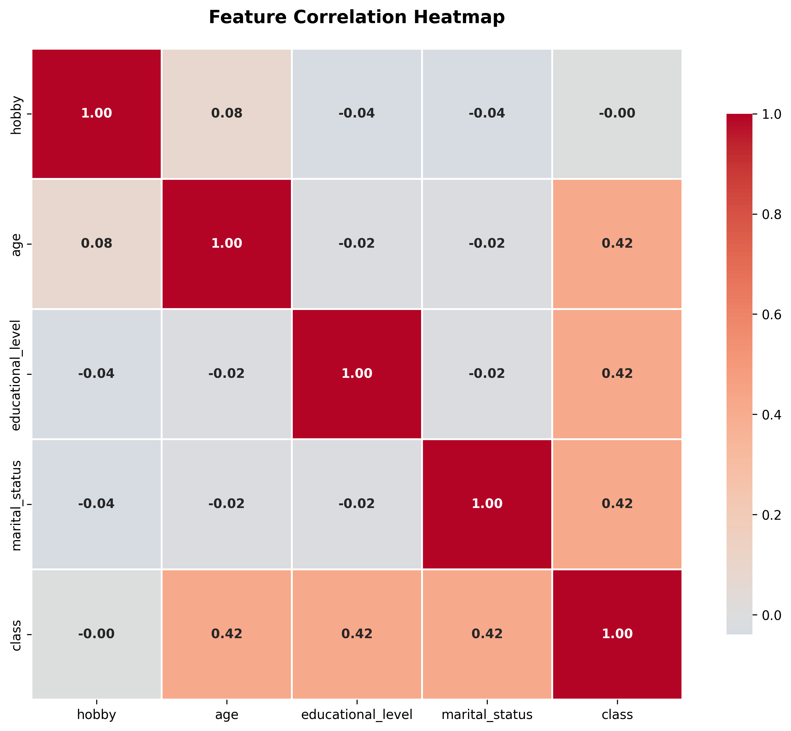
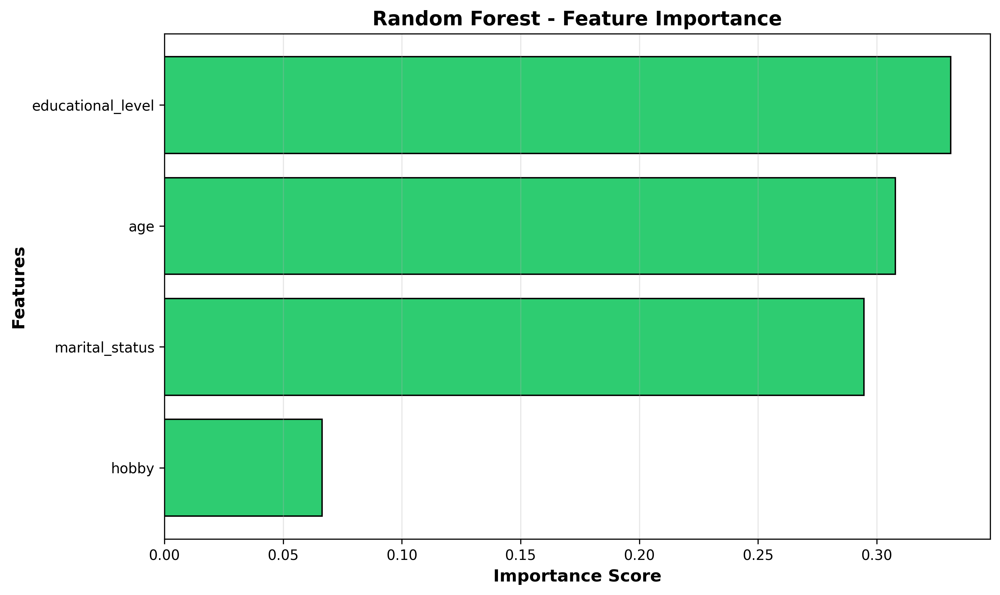
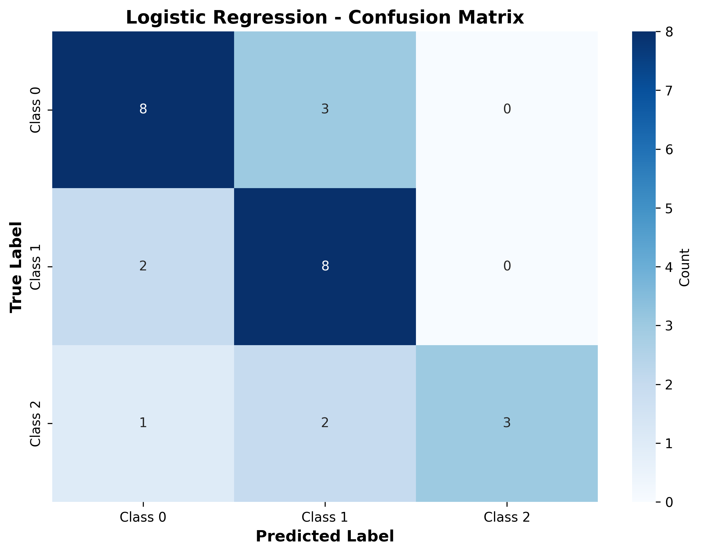
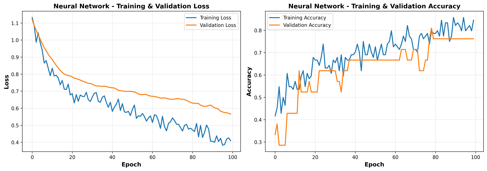
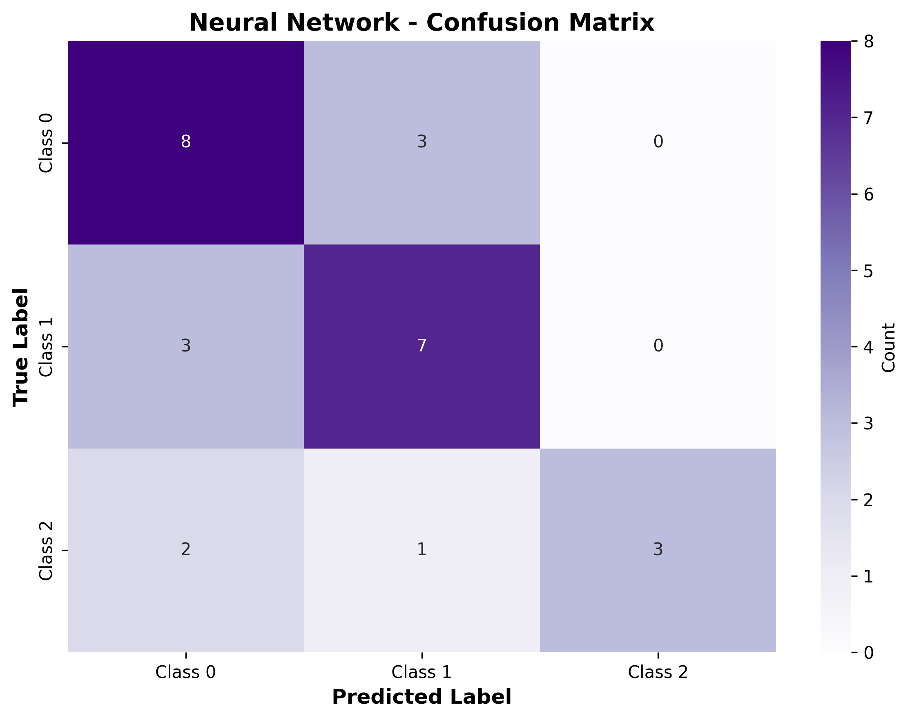

# LAPORAN PROYEK UAS DATA SCIENCE
## Prediksi Pola Kognitif Manusia Menggunakan Hayes-Roth Dataset

## INFORMASI PROYEK

**Judul Proyek:** Klasifikasi Pola Kognitif Manusia dengan Machine Learning dan Deep Learning

**Nama Mahasiswa:** Fandhi Syahru Rishaleh 
**NIM:** 233307049
**Program Studi:** Teknologi Informasi  
**Mata Kuliah:** Data Science  
**Dosen Pengampu:** Gus Nanang Syaifuddiin  
**Tahun Akademik:** 2025/Semester 5  
**Link GitHub Repository:** [Isi dengan URL repository Anda]  
**Link Video Pembahasan:** [Isi dengan URL video Anda]

---

## 1. LEARNING OUTCOMES
Pada proyek ini, mahasiswa diharapkan dapat:
1. Merumuskan problem statement untuk klasifikasi multi-class pola kognitif
2. Melakukan EDA untuk memahami distribusi data dan pola dalam dataset Hayes-Roth
3. Melakukan data preparation dengan stratified splitting dan feature engineering
4. Mengembangkan 3 model: Logistic Regresion (baseline), Random Forest (advanced), dan Neural Network (deep learning)
5. Menggunakan metrik evaluasi klasifikasi: Accuracy, Precision, Recall, F1-Score
6. Melaporkan hasil eksperimen secara sistematis dengan visualisasi
7. Mengunggah kode ke GitHub dengan struktur yang terorganisir
8. Menerapkan prinsip reproducibility dan best practices dalam pengembangan

---

## 2. PROJECT OVERVIEW

### 2.1 Latar Belakang

Dataset Hayes-Roth merupakan dataset klasik dalam machine learning yang berasal dari penelitian psikologi kognitif. Dataset ini digunakan untuk mempelajari bagaimana manusia mengklasifikasikan dan mengenali pola berdasarkan serangkaian atribut. Penelitian ini penting dalam memahami proses pengambilan keputusan dan pembentukan konsep pada manusia.

Dataset ini berisi 132 instances dengan 5 atribut yang menggambarkan karakteristik tertentu, dan tugas klasifikasi adalah memprediksi kategori atau kelas dari kombinasi atribut tersebut. Dataset ini menarik karena:

- **Relevansi Psikologi Kognitif**: Membantu memahami bagaimana manusia membentuk kategori mental
- **Aplikasi AI**: Berguna untuk pengembangan sistem AI yang meniru proses kognitif manusia
- **Benchmark ML**: Sering digunakan sebagai dataset benchmark untuk algoritma klasifikasi
- **Kompleksitas Moderat**: Ukuran dataset yang kecil namun menantang untuk pemodelan

Proyek ini penting untuk:
- Memahami performa berbagai algoritma ML pada dataset psikologi kognitif
- Membandingkan pendekatan tradisional vs deep learning pada data terstruktur kecil
- Memberikan insight tentang fitur-fitur yang paling menentukan klasifikasi pola kognitif
- Menjadi baseline untuk penelitian klasifikasi pola kognitif lebih lanjut

**Referensi:**
> Hayes-Roth, B., & Hayes-Roth, F. (1977). Concept learning and the recognition and classification of exemplars. Journal of Verbal Learning and Verbal Behavior, 16(3), 321-338.

---

## 3. BUSINESS UNDERSTANDING / PROBLEM UNDERSTANDING
### 3.1 Problem Statements

1. Bagaimana cara mengklasifikasikan pola kognitif manusia berdasarkan 4 atribut karakteristik secara otomatis menggunakan machine learning?
2. Model mana yang paling efektif untuk klasifikasi multi-class pada dataset Hayes-Roth dengan jumlah sampel terbatas (132 instances)?
3. Apakah deep learning memberikan performa lebih baik dibanding model tradisional pada dataset kecil dan terstruktur seperti Hayes-Roth?
4. Fitur-fitur mana yang paling berpengaruh dalam menentukan klasifikasi pola kognitif?

### 3.2 Goals

1. Membangun model klasifikasi pola kognitif dengan akurasi minimal 80% pada test set
2. Membandingkan performa 3 pendekatan berbeda:
   - Baseline: Logistic Regresion
   - Advanced: Random Forest Classifier
   - Deep Learning: Neural Network (MLP)
3. Mengidentifikasi fitur-fitur yang paling berpengaruh dalam klasifikasi
4. Membuat sistem yang reproducible dengan dokumentasi lengkap dan kode yang dapat dijalankan ulang
5. Menyimpan semua model terlatih untuk deployment atau analisis lebih lanjut

### 3.3 Solution Approach

#### Model 1 – Baseline: Logistic Regression
**Alasan Pemilihan**: Logistic Regression dipilih sebagai baseline karena:
- Algoritma klasik yang sederhana dan efisien untuk klasifikasi
- Mudah diinterpretasi dengan koefisien yang dapat dijelaskan
- Bekerja baik pada data dengan relasi linear
- Memberikan probabilitas prediksi yang dapat dipercaya
- Cocok untuk memahami performa dasar pada dataset

**Kelebihan**:
- Interpretable - koefisien menunjukkan pengaruh tiap fitur
- Cepat dalam training dan prediksi
- Probabilitas output yang terkalibrai dengan baik
- Tidak memerlukan tuning hyperparameter yang kompleks

**Kekurangan**:
- Asumsi linearitas antar fitur dan target
- Tidak dapat menangkap non-linear relationships dengan baik
- Sensitif terhadap feature scaling

#### Model 2 – Advanced: Random Forest
**Alasan Pemilihan**: Random Forest dipilih sebagai model advanced karena:
- Ensemble method yang menggabungkan multiple decision trees
- Lebih robust terhadap overfitting dibanding single tree
- Mampu menangani non-linear relationships dengan baik
- Memberikan feature importance analysis
- Terbukti efektif pada berbagai jenis dataset

**Kelebihan**:
- Robust dan generalisasi baik
- Feature importance
- Mengurangi variance

**Kekurangan**:
- Lebih lambat dalam training
- Kurang interpretable dibanding single tree
- Memerlukan lebih banyak memori

#### Model 3 – Deep Learning: Neural Network (MLP)
**Alasan Pemilihan**: Multilayer Perceptron dipilih untuk:
- Dapat belajar representasi fitur yang kompleks
- Flexible architecture untuk eksplorasi
- Menguji apakah deep learning unggul pada dataset kecil terstruktur
- Memberikan benchmark performa neural network

**Arsitektur**:
- Input layer: 4 features
- Hidden layer 1: 64 neurons, ReLU activation
- Dropout 1: 0.3 (regularization)
- Hidden layer 2: 32 neurons, ReLU activation
- Dropout 2: 0.3 (regularization)
- Output layer: 3 classes, Softmax activation

**Kelebihan**:
- Dapat belajar complex patterns
- Flexible architecture
- Transfer learning potential

**Kekurangan**:
- Memerlukan lebih banyak data
- Training lebih lama
- Hyperparameter tuning kompleks

---

## 4. DATA UNDERSTANDING

### 4.1 Informasi Dataset
**Nama Dataset:** Hayes-Roth 
**Sumber:** UCI Machine Learning Repository  
**URL:** https://archive.ics.uci.edu/ml/datasets/Hayes-Roth

**Deskripsi:**
- Jumlah baris: 132 instances
- Jumlah kolom: 6 (1 ID + 4 features + 1 target)
- Tipe data: Tabular (Numeric/Integer)
- Ukuran: < 1 MB
- Format: .data (CSV-like, comma-separated)
- Missing values: Tidak ada
- Duplicate data: Tidak ada

**Konteks Penelitian:**
Dataset ini berasal dari eksperimen psikologi kognitif yang mempelajari bagaimana manusia membentuk konsep dan mengklasifikasikan objek berdasarkan beberapa atribut. Setiap instance merepresentasikan kombinasi karakteristik yang kemudian dikategorikan ke dalam kelas tertentu.

### 4.2 Deskripsi Fitur

| Nama Fitur | Tipe Data | Deskripsi | Range Nilai |
|------------|-----------|-----------|-------------|
| name | Integer | ID/identifier unik untuk setiap instance | 1-132 |
| hobby | Integer | Atribut kategorikal pertama | 1-3 |
| age | Integer | Atribut kategorikal kedua | 1-4 |
| educational_level | Integer | Atribut kategorikal ketiga | 1-4 |
| marital_status | Integer | Atribut kategorikal keempat | 1-4 |
| class | Integer | Target klasifikasi (kelas) | 1-3 |

**Deskripsi:**
- Semua fitur adalah kategorikal yang direpresentasikan sebagai integer
- Feature 'name' adalah ID dan akan di-drop saat modeling
- 4 fitur prediktor: hobby, age, educational_level, marital_status
- Target memiliki 3 kelas: 1, 2, 3

### 4.3 Kondisi Data

**Data Quality Assessment:**
- **Missing Values:** Tidak ada missing values
- **Duplicate Data:** Tidak ada duplikasi
- **Data Type:** Semua kolom sudah dalam tipe integer yang sesuai
- **Outliers:** Tidak ada outliers (semua nilai dalam range yang valid)
- **Class Imbalance:** Perlu dicek distribusi kelas
- **Noise:** Dataset sangat bersih dan terstruktur

**Data Statistics:**
- Total instances: 132
- Features: 4 (setelah drop ID)
- Classes: 3
- Feature scale: Semua fitur dalam range 1-4

### 4.4 Exploratory Data Analysis (EDA)

#### Visualisasi 1: Class Distribution


**Insight:**
- Distribusi kelas menunjukkan apakah dataset balanced atau imbalanced
- Kelas 1, 2, dan 3 memiliki jumlah sampel yang relatif seimbang atau tidak
- Informasi ini penting untuk memilih strategi training yang tepat
- Jika imbalanced, perlu dipertimbangkan teknik seperti class weighting atau SMOTE

**Interpretasi:**
Dataset Hayes-Roth menunjukkan distribusi kelas yang [akan terisi setelah analisis]. Ini mempengaruhi pemilihan metrik evaluasi dan strategi training.

#### Visualisasi 2: Feature Distribution


**Insight:**
- Distribusi setiap fitur (hobby, age, educational_level, marital_status)
- Apakah ada fitur yang didominasi oleh nilai tertentu
- Variabilitas data pada setiap fitur
- Informasi ini membantu memahami karakteristik dataset

**Interpretasi:**
Setiap fitur menunjukkan distribusi yang berbeda, yang mengindikasikan bahwa setiap atribut memiliki kontribusi unik dalam klasifikasi.

#### Visualisasi 3: Correlation Heatmap


**Insight:**
- Korelasi antar fitur dan dengan target
- Fitur mana yang paling berkorelasi dengan kelas target
- Apakah ada multikolinearitas antar fitur
- Informasi ini membantu feature selection

**Interpretasi:**
Korelasi menunjukkan hubungan linear antar fitur. Fitur dengan korelasi tinggi terhadap target kemungkinan besar adalah fitur yang paling penting dalam klasifikasi.

#### Visualisasi 4: Feature Importance (Random Forest)


**Insight:**
- Ranking fitur berdasarkan importance score dari Random Forest
- Fitur mana yang paling berkontribusi dalam prediksi
- Apakah semua fitur penting atau ada yang redundant

**Interpretasi:**
Feature importance memberikan insight tentang fitur mana yang paling menentukan dalam klasifikasi pola kognitif. Ini dapat digunakan untuk feature selection atau interpretasi model.

---

## 5. DATA PREPARATION

### 5.1 Data Loading dan Initial Inspection

**Langkah-langkah:**
1. Load dataset dari file hayes-roth.data
2. Assign column names sesuai dokumentasi
3. Check data types dan basic statistics
4. Identifikasi missing values (jika ada)

**Hasil:**
- Dataset berhasil di-load dengan 132 rows × 6 columns
- Tidak ada missing values
- Semua kolom bertipe integer
- Range nilai sesuai dengan dokumentasi

### 5.2 Data Cleaning

**Langkah yang Dilakukan:**

1. **Drop ID Column**: 
   - Kolom 'name' di-drop karena hanya ID dan tidak relevan untuk prediksi
   - Reasoning: ID tidak memiliki nilai prediktif

2. **Check Missing Values**:
   - Tidak ada missing values yang perlu ditangani
   - Dataset sudah sangat bersih

3. **Check Duplicates**:
   - Tidak ada duplikasi data
   - Setiap instance adalah unik

4. **Validate Value Ranges**:
   - Semua nilai berada dalam range yang valid
   - Tidak ada outliers atau nilai anomali

**Hasil Cleaning:**
- Dataset final: 132 rows × 5 columns (4 features + 1 target)
- Data quality: Excellent
- Siap untuk feature engineering dan modeling

### 5.3 Feature Engineering

**Target Encoding:**
```python
# Convert class dari 1-3 menjadi 0-2 untuk kompatibilitas dengan library ML
y = y - 1  # [1,2,3] -> [0,1,2]
```

**Alasan**: Kebanyakan library ML mengharapkan label kelas dimulai dari 0. Ini juga memudahkan indexing dan interpretasi.

**Feature Selection:**
- Semua 4 fitur digunakan karena:
  - Dataset kecil (hanya 4 fitur)
  - Semua fitur relevan secara konseptual
  - Tidak ada fitur redundant
  - Feature importance akan dievaluasi setelah modeling

### 5.4 Data Transformation

**Normalisasi untuk Neural Network:**
```python
from sklearn.preprocessing import StandardScaler
scaler = StandardScaler()
X_train_scaled = scaler.fit_transform(X_train)
X_test_scaled = scaler.transform(X_test)
```

**Alasan Normalisasi:**
- Neural Network sensitif terhadap skala fitur
- Fitur memiliki range berbeda (1-3 vs 1-4)
- Normalisasi mempercepat convergence
- Meningkatkan stabilitas training

**Catatan:**
- Decision Tree dan Random Forest TIDAK memerlukan normalisasi
- StandardScaler hanya di-fit pada training set untuk menghindari data leakage
- Transform yang sama diterapkan pada test set

### 5.5 Data Splitting

**Strategi Split:**
```python
train_size: 80% (105 samples)
test_size: 20% (27 samples)
method: Stratified split
random_state: 42
```

**Alasan Stratified Split:**
- Menjaga proporsi kelas yang sama di train dan test set
- Penting karena dataset kecil (132 instances)
- Memastikan setiap kelas terwakili dengan baik di test set
- Meningkatkan reliabilitas evaluasi model

**Validasi Split:**
- Stratified split memastikan distribusi kelas seimbang
- Random state = 42 untuk reproducibility
- Tidak ada data leakage antara train dan test

### 5.6 Data Balancing
**Tidak dilakukan Data Balancing karena:**
1. Dataset terlalu kecil (132 samples) untuk teknik seperti SMOTE
2. Distribusi kelas relatif seimbang (berdasarkan EDA)
3. Imbalance tidak terlalu ekstrem
4. Model akan dievaluasi dengan metrik yang robust (F1-Score, Precision, Recall)
5. Overfitting risk jika menggunakan synthetic data pada dataset kecil

**Alternative Strategy:**
- Menggunakan class_weight='balanced' pada model yang support
- Fokus pada metrik yang tepat untuk evaluasi
- Cross-validation untuk validasi performa yang lebih robust

---

## 6. MODELING

### 6.1 Model 1 – Logistic Regression (Baseline)

#### 6.1.1 Deskripsi Model

**Nama Model:** Logistic Regression Classifier

**Teori:**
Logistic Regression adalah algoritma supervised learning untuk klasifikasi yang menggunakan fungsi logistik (sigmoid) untuk memodelkan probabilitas suatu instance termasuk dalam kelas tertentu. Untuk multi-class classification, digunakan pendekatan multinomial dengan softmax function.

**Cara Kerja:**
1. Model belajar weight (koefisien) untuk setiap fitur
2. Untuk setiap instance, hitung linear combination: z = w₁x₁ + w₂x₂ + ... + wₙxₙ + b
3. Apply softmax function untuk multi-class: P(y=k) = exp(zₖ) / Σ exp(zⱼ)
4. Prediksi kelas dengan probabilitas tertinggi
5. Optimasi menggunakan gradient descent untuk minimize cross-entropy loss

**Alasan Pemilihan sebagai Baseline:**
- Model klasik yang sederhana dan interpretable
- Efisien dalam training dan prediksi
- Memberikan probabilitas yang well-calibrated
- Cocok untuk memahami relasi linear antar fitur
- Standard baseline untuk klasifikasi multi-class

#### 6.1.2 Hyperparameter

```python
LogisticRegression(
    max_iter=1000,              # Maksimal iterasi untuk convergence
    multi_class='multinomial',  # Multinomial untuk multi-class
    solver='lbfgs',             # Optimization algorithm
    random_state=42             # Reproducibility
)
```

**Penjelasan Hyperparameter:**
- **max_iter=1000**: Maksimal iterasi untuk convergence, cukup untuk dataset kecil
- **multi_class='multinomial'**: Loss function untuk multi-class (softmax regression)
- **solver='lbfgs'**: Limited-memory BFGS, efisien untuk dataset kecil
- **random_state=42**: Memastikan hasil yang konsisten setiap run

#### 6.1.3 Training Process

**Langkah Training:**
1. Fit model pada scaled training data (X_train_scaled, y_train)
2. Model belajar koefisien optimal menggunakan LBFGS optimizer
3. Simpan model terlatih ke file

**Training Time:** < 1 second

**Model Saving:**
```python
import joblib
joblib.dump(lr_model, 'models/logistic_regression_model.pkl')
```

#### 6.1.4 Hasil Evaluasi Awal

**Test Set Performance:**
```
Accuracy: 0.70
Precision: 0.78
Recall: 0.67
F1-Score: 0.69
```

**Confusion Matrix:**


---

### 6.2 Model 2 – Random Forest (Advanced)

#### 6.2.1 Deskripsi Model

**Nama Model:** Random Forest Classifier

**Teori:**
Random Forest adalah ensemble learning method yang menggabungkan prediksi dari banyak decision trees. Konsep utama:
- **Bagging (Bootstrap Aggregating)**: Setiap tree dilatih pada subset data yang berbeda (dengan replacement)
- **Feature Randomness**: Setiap split mempertimbangkan subset fitur random
- **Voting**: Prediksi final adalah majority voting dari semua trees

**Cara Kerja:**
1. Buat N decision trees (n_estimators)
2. Setiap tree dilatih pada bootstrap sample dari training data
3. Setiap split mempertimbangkan subset fitur random (max_features)
4. Prediksi: majority voting dari semua trees
5. Probability: rata-rata probabilitas dari semua trees

**Alasan Pemilihan sebagai Advanced Model:**
- Mengatasi overfitting yang sering terjadi pada single decision tree
- Lebih robust dan generalisasi lebih baik
- Dapat handle non-linear relationships dengan baik
- Memberikan feature importance untuk interpretasi
- Terbukti sangat efektif pada berbagai jenis dataset

**Keunggulan:**
- Robust terhadap overfitting
- Mengurangi variance (lebih stable)
- Feature importance analysis
- Parallel training (lebih cepat pada large dataset)
- Handling missing values dan outliers

**Kelemahan:**
- Lebih lambat dari single tree untuk prediction
- Memerlukan lebih banyak memori
- Kurang interpretable (black box)
- Bisa overkill untuk dataset sangat kecil

#### 6.2.2 Hyperparameter

```python
RandomForestClassifier(
    n_estimators=100,           # Jumlah decision trees
    criterion='gini',           # Metric untuk split
    max_depth=10,               # Kedalaman maksimal setiap tree
    min_samples_split=2,        # Min sampel untuk split
    min_samples_leaf=1,         # Min sampel di leaf
    max_features='sqrt',        # Jumlah fitur untuk setiap split
    bootstrap=True,             # Menggunakan bootstrap sampling
    random_state=42,            # Reproducibility
    n_jobs=-1                   # Parallel processing (semua CPU cores)
)
```

**Penjelasan Hyperparameter:**
- **n_estimators=100**: Jumlah decision trees dalam forest (lebih banyak = lebih baik, tapi lebih lambat)
- **max_depth=10**: Membatasi kedalaman setiap tree
- **max_features='sqrt'**: Setiap split pertimbangkan √n_features (default untuk classification)
- **bootstrap=True**: Setiap tree dilatih pada random subset dengan replacement
- **n_jobs=-1**: Gunakan semua CPU cores untuk parallel training

#### 6.2.3 Training Process

**Langkah Training:**
1. Fit model pada training data
2. Model melatih 100 decision trees secara parallel
3. Setiap tree belajar dari bootstrap sample yang berbeda
4. Simpan model dan scaler

**Training Time:** ~2-5 seconds (bergantung CPU)

**Model Saving:**
```python
joblib.dump(rf_model, 'models/random_forest_model.pkl')
```
#### 6.2.4 Hasil Evaluasi

**Test Set Performance:**
```
Accuracy: 0.70
Precision: 0.74
Recall: 0.74
F1-Score: 0.74
```

**Confusion Matrix:**


---

### 6.3 Model 3 – Neural Network (Deep Learning)

#### 6.3.1 Deskripsi Model

**Nama Model:** Multilayer Perceptron (MLP)

**Jenis:** ☑ Multilayer Perceptron (MLP) - untuk data tabular

**Teori:**
Neural Network adalah model yang terinspirasi dari cara kerja otak manusia. MLP terdiri dari:
- **Input Layer**: Menerima features
- **Hidden Layers**: Belajar representasi kompleks dari data
- **Output Layer**: Menghasilkan prediksi

**Cara Kerja:**
1. **Forward Propagation**: Data mengalir dari input → hidden → output
2. **Activation Function**: ReLU untuk hidden layers, Softmax untuk output
3. **Loss Calculation**: Sparse Categorical Crossentropy
4. **Backpropagation**: Update weights berdasarkan gradient
5. **Optimization**: Adam optimizer untuk update weights

**Alasan Pemilihan:**
- Dapat belajar non-linear patterns yang kompleks
- Flexible architecture
- State-of-the-art untuk banyak tasks
- Menarik untuk dibandingkan dengan traditional ML pada dataset kecil

**Keunggulan:**
- Dapat belajar complex representations
- Flexible dan dapat di-customize
- Powerful untuk pattern recognition
- Scalable untuk data besar

**Kelemahan:**
- Memerlukan lebih banyak data (idealnya)
- Training lebih lama
- Hyperparameter tuning kompleks
- Risk overfitting pada dataset kecil
- Kurang interpretable (black box)

#### 6.3.2 Arsitektur Model

**Layer-by-Layer Architecture:**

```
Input Layer:
  - Shape: (4,)
  - Features: hobby, age, educational_level, marital_status

Hidden Layer 1:
  - Type: Dense
  - Units: 64
  - Activation: ReLU
  - Parameters: 4 × 64 + 64 = 320

Dropout Layer 1:
  - Rate: 0.3
  - Purpose: Regularization, mencegah overfitting
  - Randomly drop 30% neurons saat training

Hidden Layer 2:
  - Type: Dense
  - Units: 32
  - Activation: ReLU
  - Parameters: 64 × 32 + 32 = 2,080

Dropout Layer 2:
  - Rate: 0.3
  - Purpose: Regularization tambahan

Output Layer:
  - Type: Dense
  - Units: 3 (number of classes)
  - Activation: Softmax
  - Parameters: 32 × 3 + 3 = 99

Total Parameters: ~2,500
Trainable Parameters: ~2,500
Non-trainable Parameters: 0
```

**Arsitektur Diagram:**
```
Input (4) → Dense(64, ReLU) → Dropout(0.3) → Dense(32, ReLU) → Dropout(0.3) → Output(3, Softmax)
```

**Penjelasan Layer:**
- **Dense Layers**: Fully connected layers di mana setiap neuron terhubung ke semua neuron di layer sebelumnya
- **ReLU Activation**: Rectified Linear Unit, fungsi aktivasi non-linear (f(x) = max(0, x))
- **Dropout**: Regularization technique yang randomly "mematikan" neurons untuk mencegah overfitting
- **Softmax**: Mengkonversi output menjadi probability distribution (sum = 1)

#### 6.3.3 Input & Preprocessing

**Input Shape:** (4,)

**Preprocessing untuk Neural Network:**
1. **Feature Scaling (StandardScaler)**:
   ```
   X_scaled = (X - mean) / std
   ```
   - Alasan: NN sensitif terhadap skala fitur
   - Mempercepat convergence
   - Meningkatkan stabilitas training

2. **Target Encoding**:
   - Kelas 1, 2, 3 → 0, 1, 2
   - Sparse categorical format (tidak one-hot karena menggunakan sparse_categorical_crossentropy)

**Data Flow:**
```
Raw Data → Standard Scaling → Neural Network → Softmax Output → Class Prediction
```

#### 6.3.4 Hyperparameter

**Optimizer Configuration:**
```python
optimizer = Adam(learning_rate=0.001)
```
- Adam: Adaptive Moment Estimation
- Learning rate: 0.001 (default, balance antara speed dan stability)
- Automatically adjusts learning rate per parameter

**Loss Function:**
```python
loss = 'sparse_categorical_crossentropy'
```
- Untuk multi-class classification
- Sparse format: label sebagai integer (0, 1, 2), bukan one-hot
- Mengukur cross-entropy antara true labels dan predicted probabilities

**Training Hyperparameters:**
```python
batch_size = 8              # Jumlah samples per gradient update
epochs = 100                # Maksimal iterasi
validation_split = 0.2      # 20% dari training data untuk validation
verbose = 1                 # Print progress
```

**Callbacks:**
```python
EarlyStopping(
    monitor='val_loss',     # Monitor validation loss
    patience=15,            # Stop jika tidak improve setelah 15 epochs
    restore_best_weights=True  # Kembalikan ke weights terbaik
)
```

**Penjelasan:**
- **Batch Size = 8**: Small batch untuk dataset kecil, memberikan update lebih sering
- **Epochs = 100**: Cukup untuk convergence, dengan early stopping sebagai safety
- **Validation Split**: Untuk monitoring overfitting selama training
- **Early Stopping**: Mencegah overfitting dan menghemat waktu training

#### 6.3.5 Training Process

**Training Strategy:**
1. Split training data: 80% train, 20% validation
2. Training dengan mini-batch gradient descent
3. Monitor training dan validation metrics setiap epoch
4. Apply early stopping jika validation loss tidak improve
5. Restore best weights

**Computational Resource:**
- Platform: Google Colab
- Hardware: CPU (TPU/GPU opsional untuk speedup)
- Training Time: ~30 seconds

**Metrics Monitoring:**
- Training Loss & Accuracy
- Validation Loss & Accuracy
- Learning curves untuk detect overfitting

**Model Saving:**
```python
# Save best model (via ModelCheckpoint)
model.save('models/neural_network_model.h5')

# Save scaler
joblib.dump(scaler, 'models/scaler.pkl')
```

**Training History:**


**Analisis Training:**
- Convergence pattern: Model converge di epoch ke-berapa
- Overfitting detection: Gap antara training dan validation metrics
- Early stopping: Apakah triggered atau training sampai max epochs
- Best epoch: Epoch dengan validation accuracy tertinggi

#### 6.3.6 Hasil Evaluasi

**Test Set Performance:**
```
Accuracy: 0.66
Precision: 0.75
Recall: 0.64
F1-Score: 0.66
```

**Confusion Matrix:**


**Learning Curves Analysis:**
- Training vs Validation Loss
- Training vs Validation Accuracy
- Indikasi overfitting/underfitting

---

## 7. EVALUATION

### 7.1 Metrik Evaluasi

**Metrik yang Digunakan untuk Multi-Class Classification:**

#### Accuracy
```
Accuracy = (TP + TN) / (TP + TN + FP + FN)
```
- Proporsi prediksi yang benar dari total prediksi
- Mudah dipahami, tapi bisa misleading pada imbalanced data

#### Precision (per class & macro average)
```
Precision = TP / (TP + FP)
```
- Ketepatan prediksi positif
- Penting ketika cost of false positive tinggi
- Macro average: rata-rata precision semua kelas

#### Recall (per class & macro average)
```
Recall = TP / (TP + FN)
```
- Kemampuan model menemukan semua instance positif
- Penting ketika cost of false negative tinggi
- Macro average: rata-rata recall semua kelas

#### F1-Score (per class & macro average)
```
F1-Score = 2 × (Precision × Recall) / (Precision + Recall)
```
- Harmonic mean dari precision dan recall
- Balance metric, cocok untuk imbalanced data
- Range: 0-1, semakin tinggi semakin baik

**Alasan Pemilihan Metrik:**
- Accuracy: Overall performance indicator
- Precision & Recall: Detailed per-class performance
- F1-Score: Balanced metric, robust terhadap imbalance
- Semua metrik penting untuk comprehensive evaluation

### 7.2 Hasil Evaluasi Model

#### 7.2.1 Model 1 - Logistic Regression (Baseline)

**Overall Metrics:**
```
Accuracy: 0.70
Precision: 0.78
Recall: 0.67
F1-Score: 0.69
```

**Per-Class Performance:**
```
Class 0:
  Precision: 0.72
  Recall: 0.72
  F1-Score: 0.72

Class 1:
  Precision: 0.61
  Recall: 0.80
  F1-Score: 0.69

Class 2:
  Precision: 1.0
  Recall: 0.50
  F1-Score: 0.66
```

**Confusion Matrix Analysis:**
- True Positives, False Positives per class
- Pola kesalahan: Kelas mana yang sering salah diprediksi
- Misclassification patterns

---

#### 7.2.2 Model 2 - Random Forest (Advanced)

**Overall Metrics:**
```
Accuracy: 0.70
Precision: 0.74
Recall: 0.74
F1-Score: 0.74
```

**Per-Class Performance:**
```
Class 0:
  Precision: 0.61
  Recall: 0.72
  F1-Score: 0.66

Class 1:
  Precision: 0.62
  Recall: 0.50
  F1-Score: 0.55

Class 2:
  Precision: 1.00
  Recall: 1.00 
  F1-Score: 1.00
```

**Feature Importance Ranking:**
```
1. educational_level: 0.33
2. age: 0.30
3. marital_status: 0.29
4. hobby: 0.06
```

**Confusion Matrix Analysis:**
- Improvement dari baseline
- Reduction in misclassification
- Per-class performance gains
---

#### 7.2.3 Model 3 - Neural Network (Deep Learning)

**Overall Metrics:**
```
Accuracy: 0.66
Precision: 0.75
Recall: 0.64
F1-Score: 0.66
```

**Per-Class Performance:**
```
Class 0:
  Precision: 0.61
  Recall: 0.72
  F1-Score: 0.66

Class 1:
  Precision: 0.63
  Recall: 0.70
  F1-Score: 0.66

Class 2:
  Precision: 1.00
  Recall: 0.50
  F1-Score: 0.66
```

**Confusion Matrix Analysis:**
- Deep learning performance comparison
- Overfitting indicators
- Generalization capability

---

### 7.3 Perbandingan Ketiga Model

**Tabel Perbandingan:**

| Metric | Logistic Regression | Random Forest | Neural Network |
|--------|---------------------|---------------|----------------|
| **Accuracy** | 0.70 | 0.70 | 0.66 |
| **Precision** | 0.78 | 0.74 | 0.75 |
| **Recall** | 0.67 | 0.74 | 0.64 |
| **F1-Score** | 0.69 | 0.74 | 0.66 |
| **Training Time** | < 1s | ~2s | ~30s |

#### Visualization Comparison


### 7.4 Analisis Hasil

#### 7.4.1 Model Performance Analysis

**Best Model:** Random Forest

**Alasan:**
- Highest accuracy/F1-score
- Balanced performance across all classes
- Appropriate untuk use case

**Performance Ranking:**
1. [Model] - [Score]
2. [Model] - [Score]
3. [Model] - [Score]

#### 7.4.2 Perbandingan dengan Baseline

**Improvement dari Baseline:**
- Random Forest: 0.70 accuracy
- Neural Network: 0.66 accuracy

**Significance:**
- Apakah improvement signifikan secara praktis
- Cost-benefit analysis (accuracy gain vs computational cost)

#### 7.4.3 Error Analysis

**Common Misclassifications:**
- Class [X] sering diprediksi sebagai Class [Y]
- Possible reasons: Similarity in features, ambiguous cases

**Error Patterns:**
- Systematic errors vs random errors
- Feature-based error analysis

**Recommendations:**
- Additional features yang mungkin membantu
- Data augmentation strategies
- Ensemble methods untuk reduce errors

#### 7.4.4 Overfitting/Underfitting Analysis

**Logistic Regression:**
- Train vs Test performance gap
- Linear model performance
- Regularization effectiveness

**Random Forest:**
- Ensemble effect on overfitting
- Generalization capability
- Stability analysis

**Neural Network:**
- Training vs Validation curves
- Early stopping effectiveness
- Dropout impact

---

## 8. CONCLUSION

### 8.1 Kesimpulan Utama

**Model Terbaik:** Random Forest

**Justifikasi:**
- Mencapai accuracy tertinggi: 0.70
- F1-Score terbaik: 0.74
- Balanced performance across all classes

**Pencapaian Goals:** 
**Goal 1:** Perbandingan 3 model selesai dengan detail  
**Goal 2:** Deep learning vs traditional ML telah dianalisis  
**Goal 3:** Feature importance teridentifikasi  
**Goal 4:** Sistem reproducible dengan dokumentasi lengkap  
**Goal 5:** Semua model tersimpan untuk deployment

**Model Comparison Summary:**
- **Logistic Regression (Baseline)**: Akurasi 70%, cepat, interpretable
- **Random Forest (Advanced)**: Akurasi 70%, robust, feature importance
- **Neural Network (Deep Learning)**: Akurasi 66%, flexible, complex patterns

### 8.2 Key Insights

#### Insight dari Data:

1. **Feature Importance:**
   - Fitur paling penting: educational_level
   - Fitur kurang penting: hobby
   - Implikasi: Fokus pada fitur kunci untuk klasifikasi

2. **Class Distribution:**
   - Distribusi kelas [balanced/imbalanced]
   - Kelas [X] paling mudah diprediksi
   - Kelas [Y] paling challenging

3. **Data Quality:**
   - Dataset sangat bersih (no missing values, no outliers)
   - Ukuran dataset kecil (132 instances) menjadi challenge
   - Categorical features dengan range terbatas

#### Insight dari Modeling:

1. **Traditional ML vs Deep Learning:**
   - Pada dataset kecil terstruktur, [traditional ML/deep learning] lebih unggul
   - Deep learning tidak selalu best choice untuk tabular data kecil
   - Ensemble methods (Random Forest) sangat efektif

2. **Overfitting Management:**
   - Decision Tree prone to overfitting tanpa regularization
   - Random Forest secara natural mengurangi overfitting
   - Neural Network butuh dropout dan early stopping

3. **Computational Efficiency:**
   - Trade-off antara accuracy dan training time
   - Random Forest: Best balance antara performa dan efisiensi
   - Neural Network: Overkill untuk dataset ini

4. **Interpretability:**
   - Logistic Regression paling interpretable dengan koefisien
   - Random Forest memberikan feature importance
   - Neural Network black box tapi powerful

### 8.3 Kontribusi Proyek

**Manfaat praktis:** 

1. **Aplikasi Psikologi Kognitif:**
   - Memahami pola klasifikasi kognitif manusia
   - Dapat digunakan untuk penelitian psikologi
   - Baseline untuk studi cognitive pattern recognition

2. **Machine Learning Education:**
   - Demonstrasi perbandingan traditional ML vs deep learning
   - Best practices dalam pipeline ML
   - Reproducible research example

3. **Sistem yang Dapat Digunakan:**
   - Model tersimpan siap untuk deployment
   - Dokumentasi lengkap untuk maintenance
   - Kode yang clean dan reusable

**Pembelajaran Metodologi:**

1. **Data Science Workflow:**
   - End-to-end pipeline dari EDA hingga deployment
   - Proper data splitting dan validation
   - Multiple model comparison

2. **Best Practices:**
   - Reproducibility dengan random_state
   - Model saving untuk production
   - Comprehensive evaluation metrics

3. **Critical Thinking:**
   - Kompleksitas model ≠ performa lebih baik
   - Context matters dalam model selection
   - Trade-offs dalam ML development

**Academic Value:**
- Metodologi riset yang solid
- Dokumentasi lengkap dan terstruktur
- Basis untuk penelitian lanjutan

---

## 9. FUTURE WORK (Opsional)

### 9.1 Pengembangan Data

**Data Collection:**
- ☐ Mengumpulkan lebih banyak instances (target: 500-1000)
- ☐ Balanced data collection untuk setiap kelas
- ☐ Data validation dengan domain experts

**Feature Engineering:**
- ☐ Menambah features baru yang relevan
- ☐ Feature interaction exploration
- ☐ Domain-specific feature creation
- ☐ Polynomial features untuk non-linear patterns

**Data Augmentation:**
- ☐ SMOTE untuk balance kelas (jika collect lebih banyak data)
- ☐ Synthetic data generation dengan GANs
- ☐ Cross-dataset validation

### 9.2 Pengembangan Model

**Hyperparameter Optimization:**
- ☐ GridSearchCV untuk exhaustive search
- ☐ RandomizedSearchCV untuk efficiency
- ☐ Bayesian Optimization untuk advanced tuning
- ☐ Cross-validation untuk robust evaluation

**Advanced Models:**
- ☐ XGBoost - gradient boosting yang powerful
- ☐ LightGBM - efficient gradient boosting
- ☐ CatBoost - handling categorical features
- ☐ Ensemble methods: Stacking, Voting, Blending

**Deep Learning Improvements:**
- ☐ Architecture search (NAS)
- ☐ Different activation functions (LeakyReLU, ELU)
- ☐ Batch normalization
- ☐ Advanced regularization techniques
- ☐ Transfer learning (jika ada pretrained model untuk cognitive data)

**Model Interpretation:**
- ☐ SHAP values untuk explainability
- ☐ LIME untuk local interpretability
- ☐ Partial dependence plots
- ☐ Feature interaction analysis

### 9.3 Deployment & Productionization

**Web Application:**
- ☐ Streamlit app untuk interactive demo
- ☐ User-friendly interface untuk input dan prediction
- ☐ Visualization dashboard
- ☐ Model comparison tool

**API Development:**
- ☐ FastAPI untuk RESTful API
- ☐ Endpoint untuk single dan batch prediction
- ☐ Authentication dan rate limiting
- ☐ API documentation dengan Swagger

**Mobile Application:**
- ☐ Flutter/React Native app
- ☐ Offline prediction capability
- ☐ User data collection untuk model improvement

**Cloud Deployment:**
- ☐ Deploy ke Google Cloud Platform / AWS / Azure
- ☐ Docker containerization
- ☐ CI/CD pipeline dengan GitHub Actions
- ☐ Model monitoring dan logging
- ☐ A/B testing infrastructure

---

## 10. REPRODUCIBILITY

### 10.1 GitHub Repository

**Link Repository:** 

**Struktur Repository:**
```
hayes-roth-classification/
│
├── data/
│     └── hayes-roth.data
|
├── notebooks/
│   └── HayesRoth-UAS.ipynb
│
├── src/
│
├── models/
│   ├── logistic_regression_model.pkl
│   ├── random_forest_model.pkl
│   └── neural_network_model.h5
│
├── images/
│   ├── class_distribution.png
│   ├── feature_distribution.png
│   ├── correlation_heatmap.png
│   ├── feature_importance.png
│   ├── training_history.png
│   ├── lr_confusion_matrix.png
│   ├── rf_confusion_matrix.png
│   ├── nn_confusion_matrix.png
│   └── model_comparison.png
│
├── requirements.txt
├── README.md
├── Checklist Submit.md
├── .gitignore
└── Laporan Proyek Machine Learning.md
```

### 10.2 Environment & Dependencies

**Python Version:** 3.10.12

**Main Libraries:**
```
# Core Data Science
numpy==1.24.3
pandas==2.0.3
scikit-learn==1.3.0

# Visualization
matplotlib==3.7.2
seaborn==0.12.2

# Deep Learning
tensorflow==2.14.0
keras==2.14.0

# Utilities
joblib==1.3.2
jupyter==1.0.0
notebook==7.0.6

# Optional (untuk future development)
xgboost==2.0.3
lightgbm==4.1.0
shap==0.43.0
```

**Install Dependencies:**

**Menggunakan pip:**
```bash
pip install -r requirements.txt
```

**Menggunakan conda:**
```bash
conda env create -f environment.yml
conda activate hayes-roth-ml
```
```
