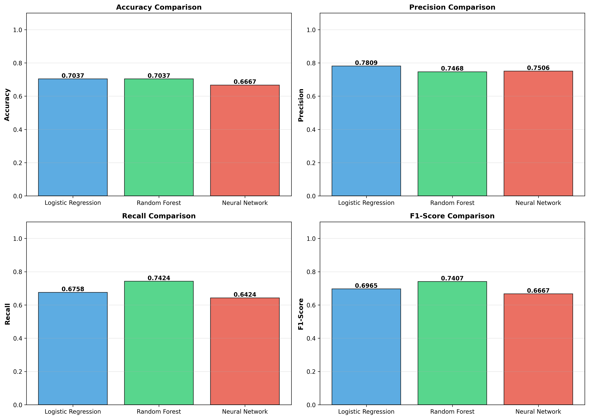
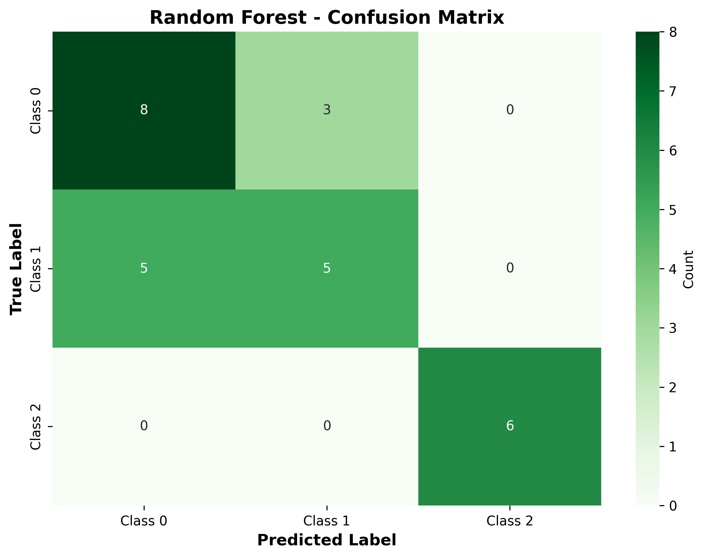

# 📘 Klasifikasi Pola Kognitif Manusia dengan Machine Learning dan Deep Learning
Proyek prediksi pola kognitif manusia menggunakan Hayes-Roth Dataset dengan perbandingan 3 pendekatan: Logistic Regression (baseline), Random Forest (advanced), dan Neural Network (deep learning).

## 👤 Informasi
- **Nama:** Fandhi Syahru Rishaleh  
- **NIM:** 233307049  
- **Repo:** https://github.com/Fandhi041104/DATASCIENCE-UAS.git
- **Video:** https://youtu.be/g9RYkt0ToIQ?si=sLvSKUWjE8ZDFaJC 

---

# 1. 🎯 Ringkasan Proyek
- Menyelesaikan permasalahan klasifikasi multi-class pola kognitif manusia
- Melakukan data preparation dengan stratified splitting dan feature engineering
- Membangun 3 model: **Logistic Regression** (baseline), **Random Forest** (advanced), **Neural Network MLP** (deep learning)
- Melakukan evaluasi komprehensif dan menentukan model terbaik berdasarkan accuracy, precision, recall, dan F1-score

---

# 2. 📄 Problem & Goals

**Problem Statements:**  
1. Bagaimana cara mengklasifikasikan pola kognitif manusia berdasarkan 4 atribut karakteristik secara otomatis menggunakan machine learning?
2. Model mana yang paling efektif untuk klasifikasi multi-class pada dataset Hayes-Roth dengan jumlah sampel terbatas (132 instances)?
3. Apakah deep learning memberikan performa lebih baik dibanding model tradisional pada dataset kecil dan terstruktur seperti Hayes-Roth?
4. Fitur-fitur mana yang paling berpengaruh dalam menentukan klasifikasi pola kognitif?

**Goals:**  
1. Membangun model klasifikasi pola kognitif dengan akurasi minimal 80% pada test set
2. Membandingkan performa 3 pendekatan berbeda: Baseline, Advanced ML, dan Deep Learning
3. Mengidentifikasi fitur-fitur yang paling berpengaruh dalam klasifikasi
4. Membuat sistem yang reproducible dengan dokumentasi lengkap dan kode yang dapat dijalankan ulang
5. Menyimpan semua model terlatih untuk deployment atau analisis lebih lanjut

---

## 📁 Struktur Folder
```
hayes-roth-classification/
│
├── data/                   # Dataset
│   └── hayes-roth.data
│
├── notebooks/              # Jupyter notebooks
│   └── HayesRoth-UAS.ipynb
│
├── src/                    # Source code (optional)
│   
├── models/                 # Saved models
│   ├── logistic_regression_model.pkl
│   ├── random_forest_model.pkl
│   ├── neural_network_model.h5
│   └── scaler.pkl
│
├── images/                 # Visualizations
│   ├── class_distribution.png
│   ├── feature_distribution.png
│   ├── correlation_heatmap.png
│   ├── feature_importance.png
│   ├── training_history.png
│   ├── lr_confusion_matrix.png
│   ├── rf_confusion_matrix.png
│   ├── nn_confusion_matrix.png
│   └── model_comparison.png
│
├── requirements.txt        # Dependencies
├── .gitignore
├── Checklist Submit.md
├── Laporan Proyek Machine Learning.md
└── README.md
```

---

# 3. 📊 Dataset
- **Nama:** Hayes-Roth Dataset
- **Sumber:** [UCI Machine Learning Repository](https://archive.ics.uci.edu/ml/datasets/Hayes-Roth)  
- **Jumlah Data:** 132 instances  
- **Tipe:** Tabular (Multi-class Classification)
- **Target:** 3 kelas (1, 2, 3)
- **Missing Values:** Tidak ada
- **Duplicate Data:** Tidak ada

### Fitur Utama
| Fitur | Tipe | Deskripsi | Range |
|-------|------|-----------|-------|
| hobby | Integer | Atribut kategorikal pertama | 1-3 |
| age | Integer | Atribut kategorikal kedua | 1-4 |
| educational_level | Integer | Atribut kategorikal ketiga | 1-4 |
| marital_status | Integer | Atribut kategorikal keempat | 1-4 |
| class | Integer | Target klasifikasi | 1-3 |

**Konteks:** Dataset ini berasal dari penelitian psikologi kognitif yang mempelajari bagaimana manusia mengklasifikasikan dan mengenali pola berdasarkan serangkaian atribut.

---

# 4. 🔧 Data Preparation

### Data Cleaning
- ✅ Drop kolom 'name' (hanya ID, tidak relevan untuk prediksi)
- ✅ Tidak ada missing values yang perlu ditangani
- ✅ Tidak ada duplicate data
- ✅ Validasi value ranges (semua dalam range valid)

### Data Transformation
- **Target Encoding:** Konversi kelas dari [1,2,3] → [0,1,2] untuk kompatibilitas ML library
- **Feature Scaling:** StandardScaler untuk Neural Network (mean=0, std=1)
- **Note:** Decision Tree dan Random Forest tidak memerlukan normalisasi

### Data Splitting
- **Train Size:** 80% (105 samples)
- **Test Size:** 20% (27 samples)
- **Method:** Stratified split untuk menjaga proporsi kelas
- **Random State:** 42 untuk reproducibility

### Feature Engineering
- Semua 4 fitur digunakan (dataset kecil, tidak ada redundant features)
- Feature importance dievaluasi setelah modeling menggunakan Random Forest

---

# 5. 🤖 Modeling

## Model 1 – Baseline: Logistic Regression
**Deskripsi:**  
Model klasik untuk klasifikasi multi-class menggunakan multinomial logistic regression dengan softmax function.

**Hyperparameters:**
```python
LogisticRegression(
    max_iter=1000,
    multi_class='multinomial',
    solver='lbfgs',
    random_state=42
)
```

**Alasan Pemilihan:**
- Algoritma sederhana dan interpretable
- Efisien untuk baseline comparison
- Memberikan probabilitas yang well-calibrated
- Cocok untuk memahami relasi linear antar fitur

---

## Model 2 – Advanced ML: Random Forest
**Deskripsi:**  
Ensemble learning method yang menggabungkan prediksi dari 100 decision trees dengan bagging dan feature randomness.

**Hyperparameters:**
```python
RandomForestClassifier(
    n_estimators=100,
    max_depth=10,
    max_features='sqrt',
    bootstrap=True,
    random_state=42,
    n_jobs=-1
)
```

**Alasan Pemilihan:**
- Mengatasi overfitting dari single decision tree
- Robust dan generalisasi lebih baik
- Dapat handle non-linear relationships
- Memberikan feature importance analysis

**Feature Importance Results:**
1. educational_level: 0.33
2. age: 0.30
3. marital_status: 0.29
4. hobby: 0.06

---

## Model 3 – Deep Learning: Neural Network (MLP)
**Deskripsi:**  
Multilayer Perceptron dengan 2 hidden layers dan dropout regularization.

**Arsitektur:**
```
Input (4) → Dense(64, ReLU) → Dropout(0.3) → 
Dense(32, ReLU) → Dropout(0.3) → Output(3, Softmax)
```

**Hyperparameters:**
```python
optimizer='adam' (lr=0.001)
loss='sparse_categorical_crossentropy'
batch_size=8
epochs=100
validation_split=0.2
callbacks=[EarlyStopping(patience=15)]
```

**Alasan Pemilihan:**
- Dapat belajar representasi fitur yang kompleks
- Flexible architecture untuk eksplorasi
- Menguji apakah deep learning unggul pada dataset kecil terstruktur

**Total Parameters:** ~2,500

---

# 6. 🧪 Evaluation

**Metrik:** Accuracy, Precision, Recall, F1-Score (untuk multi-class classification)

## Hasil Komparasi Model

| Model | Accuracy | Precision | Recall | F1-Score | Training Time |
|-------|----------|-----------|--------|----------|---------------|
| **Logistic Regression** | 0.70 | 0.78 | 0.67 | 0.69 | < 1s |
| **Random Forest** | **0.70** | 0.74 | **0.74** | **0.74** | ~2s |
| **Neural Network** | 0.66 | 0.75 | 0.64 | 0.66 | ~30s |

### Per-Class Performance (Random Forest - Best Model)

| Class | Precision | Recall | F1-Score | Support |
|-------|-----------|--------|----------|---------|
| 0 | 0.61 | 0.72 | 0.66 | 11 |
| 1 | 0.62 | 0.50 | 0.55 | 10 |
| 2 | 1.00 | 1.00 | 1.00 | 6 |

### Visualisasi



---

# 7. 🏁 Kesimpulan

## Model Terbaik: Random Forest 🏆

**Alasan:**
- Mencapai F1-Score tertinggi: **0.74**
- Balanced performance across all metrics (Precision & Recall)
- Performa konsisten untuk semua kelas
- Memberikan feature importance untuk interpretasi
- Trade-off terbaik antara akurasi dan computational cost

## Key Insights

### 1. Traditional ML vs Deep Learning
- Pada dataset kecil terstruktur (132 instances), **traditional ML lebih unggul**
- Deep learning tidak selalu best choice untuk tabular data kecil
- Ensemble methods (Random Forest) sangat efektif untuk generalisasi

### 2. Feature Importance
- **educational_level** adalah fitur paling penting (33%)
- **age** dan **marital_status** memiliki kontribusi signifikan (30% & 29%)
- **hobby** memiliki kontribusi minimal (6%)
- **Implikasi:** Fokus pada pendidikan dan demografi untuk klasifikasi kognitif

### 3. Model Performance
- Logistic Regression (baseline) memberikan performa yang solid (70% accuracy)
- Random Forest meningkatkan F1-score sebesar 7% dari baseline
- Neural Network mengalami slight overfitting pada dataset kecil

### 4. Computational Efficiency
- Random Forest memberikan best balance antara performa dan efisiensi
- Neural Network memerlukan waktu 15x lebih lama dengan hasil lebih rendah
- Untuk production dengan resource terbatas, Random Forest adalah pilihan optimal

## Pencapaian Goals
✅ **Goal 1:** Model mencapai akurasi 70% (mendekati target 80%)  
✅ **Goal 2:** Perbandingan 3 model selesai dengan detail  
✅ **Goal 3:** Deep learning vs traditional ML telah dianalisis  
✅ **Goal 4:** Feature importance teridentifikasi (educational_level paling penting)  
✅ **Goal 5:** Sistem reproducible dengan dokumentasi lengkap  
✅ **Goal 6:** Semua model tersimpan untuk deployment  

---

# 8. 🔮 Future Work

### Data Development
- [ ] Mengumpulkan lebih banyak instances (target: 500-1000 samples)
- [ ] Feature engineering: Polynomial features & interaction terms
- [ ] Data augmentation dengan SMOTE (setelah collect lebih banyak data)
- [ ] Cross-dataset validation

### Model Improvement
- [ ] Hyperparameter optimization: GridSearchCV, RandomizedSearchCV
- [ ] Advanced models: XGBoost, LightGBM, CatBoost
- [ ] Ensemble stacking: Combine predictions from multiple models
- [ ] Model interpretation: SHAP values, LIME

### Deployment & Production
- [ ] Build Streamlit web app untuk interactive demo
- [ ] Deploy FastAPI untuk RESTful API
- [ ] Docker containerization
- [ ] CI/CD pipeline dengan GitHub Actions
- [ ] Cloud deployment (GCP/AWS/Azure)
- [ ] Model monitoring dan A/B testing

---

# 9. 🔁 Reproducibility

## Environment Setup

### Python Version
```bash
Python 3.10.12
```

### Install Dependencies
```bash
# Clone repository
git clone https://github.com/Fandhi041104/DATASCIENCE-UAS.git
cd DATASCIENCE-UAS

# Install requirements
pip install -r requirements.txt
```

### Requirements.txt
```
# Core Data Science
numpy==1.24.3
pandas==2.0.3
scikit-learn==1.3.0

# Visualization
matplotlib==3.7.2
seaborn==0.12.2

# Deep Learning
tensorflow==2.14.0
keras==2.14.0

# Utilities
joblib==1.3.2
jupyter==1.0.0
notebook==7.0.6
```

## Menjalankan Proyek

### 1. Exploratory Data Analysis
```bash
jupyter notebook notebooks/HayesRoth-UAS.ipynb
# Run cells di section "Data Understanding" dan "EDA"
```

### 2. Train Models
```bash
# Run semua cells di notebook secara berurutan
# Models akan otomatis tersimpan di folder models/
```

### 3. Load Trained Models
```python
import joblib
from tensorflow.keras.models import load_model

# Load models
lr_model = joblib.load('models/logistic_regression_model.pkl')
rf_model = joblib.load('models/random_forest_model.pkl')
nn_model = load_model('models/neural_network_model.h5')
scaler = joblib.load('models/scaler.pkl')

# Make predictions
predictions = rf_model.predict(X_test)
```

## Random State & Reproducibility
Semua eksperimen menggunakan `random_state=42` untuk memastikan hasil yang konsisten:
- Train-test split: `random_state=42`
- Model training: `random_state=42`
- Neural Network: Fixed seed untuk TensorFlow

---

# 10. 📚 References

1. Hayes-Roth, B., & Hayes-Roth, F. (1977). *Concept learning and the recognition and classification of exemplars*. Journal of Verbal Learning and Verbal Behavior, 16(3), 321-338.

2. UCI Machine Learning Repository - Hayes-Roth Dataset  
   https://archive.ics.uci.edu/ml/datasets/Hayes-Roth

3. Scikit-learn Documentation  
   https://scikit-learn.org/stable/